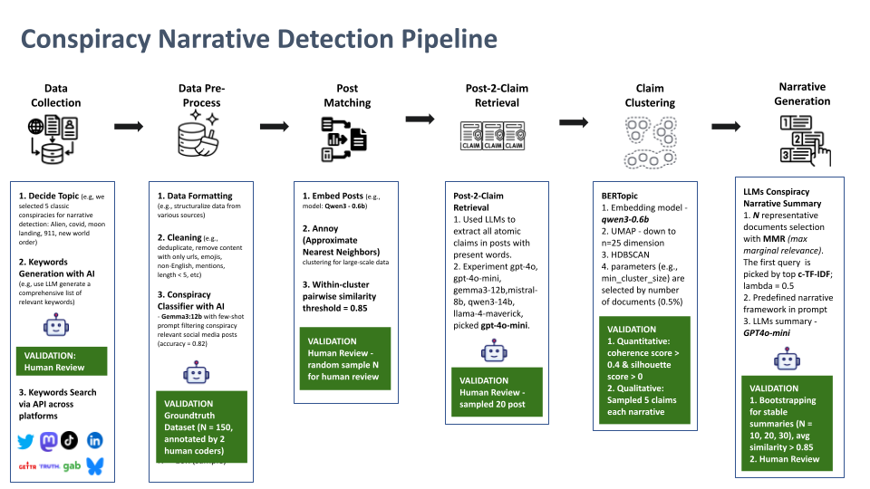
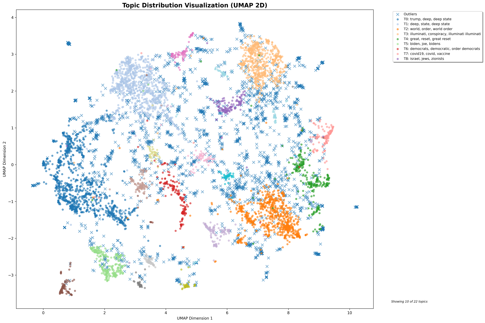
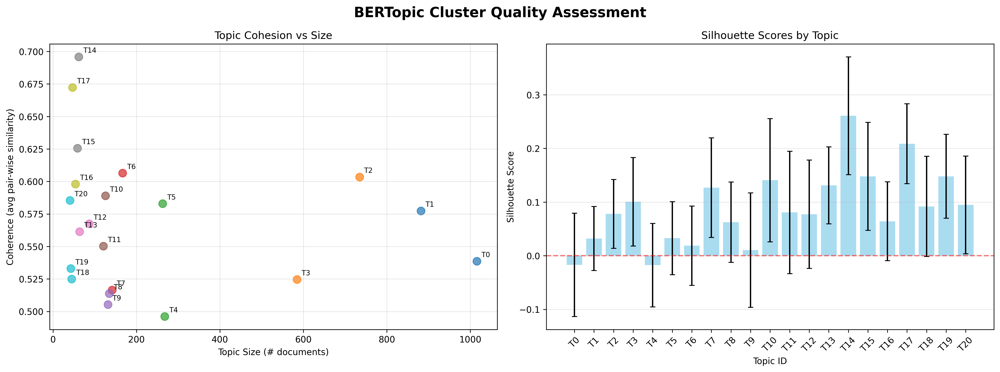
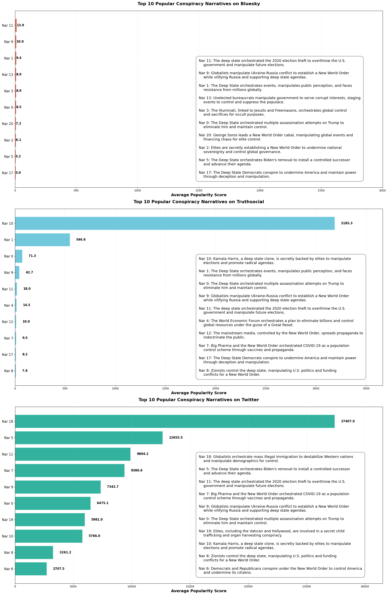
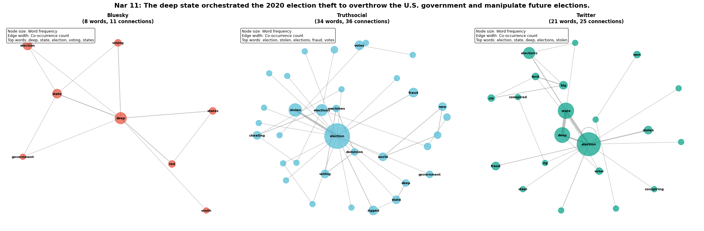

# Mapping Conspiracy Narratives Across Social Media Platforms (ongoing project)

This is an ongoing project that aims to effectively detect narratives across various social media platforms. The project utilizes a combination of data collection, natural language processing, and network analysis techniques to understand the popularity of different conspiracy narratives across platforms.

The ultimate goal of this project is to create a comprehensive and interactive dashboard that visualizes the data and insights derived from the analysis. This dashboard will allow users to explore the narratives, their popularity, and how they spread across different platforms. It is particularly helpful for journalists and fact-checkers to locate the most prominent narratives and their specific claims, thus better organizing resources to come up with customized debunking strategies and approaches to debunking conspiracy beliefs online. 

## Pipeline Overview

The pipeline consists of several following key steps:

We demonstrate the pipeline using a sample dataset of `new world order` conspiracy theories collected from three platforms: Twitter, TruthSocial and Bluesky via keywords (N = 9k). The pipeline is designed to be modular, allowing for easy adaptation to different datasets and platforms.

The source code are stored in `pipeline_files` folder, and the pipeline results are stored in `pipeline_data` folder.

## Preliminary Results of the Narrative Analysis

After running the pipeline, we observed 22 conspiracy narratives under the `new world order` conspiracy topic. Figure 1 shows the visualization of the conspiracy claims and their clusters mapping to 2D space. The size of the nodes represents the popularity of the claims, and the color represents the platform where the claim is most popular.

The next Figure 2 demonstrates our cluster quality with the coherence score and silhouette score. 

We observed that different platforms show different popularity of conspiracy narratives (i.g., Bluesky, Twitter and TruthSocial). First, CT narratives on Bluesky generally do not attract any traffic, while on Twitter and TruthSocial, CTs gain much more users' engagements. Second, CT narratives on TruthSocial are centralized on several specific narratives, while on Twitter, CTs are more diverse and spread across multiple narratives. Figure below shows the distribution top narratives across platforms.

Third, we also observed that there are some conspriacy narratives that are popular on all platforms (e.g., Narrative 11). As shown in the Figure below, we plotted the word-coorcurrence networks for conspiracy claims in Nar 11 cluster across platforms. The size of the nodes represents the frequency of the words, and the link between nodes represents the co-occurrence of the words in the same claim. While claims under this narrative are all relevant to the suspecion about the 2020 election, claims on Bluesky are simple and straightforward, while on Twitter and TruthSocial, claims involve more conspiratorial words and phrases.

## Conclusion
This preliminary results demonstrate the effectiveness of our pipeline in detecting and analyzing conspiracy narratives across different social media platforms. The insights derived from the analysis can be used to (1) locate popular conspiracy narratives and locate relevant conspiratorial claims (2) inform fact-based debunking strategies for countering conspiracy beliefs, and (3) understanding the difference of CT narratives spread across platforms.